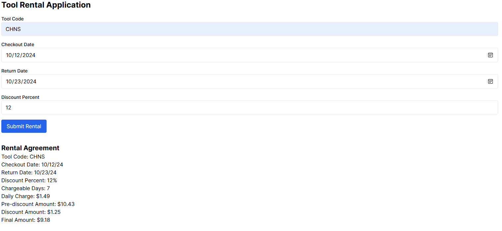
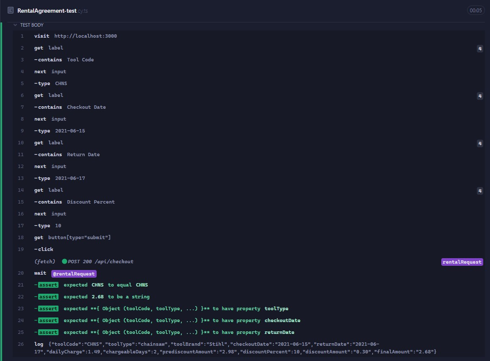
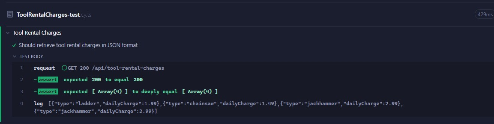
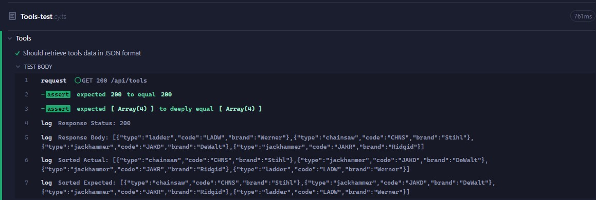

# Tool Rental Application

## Overview

The Tool Rental Application is a web-based system that allows users to rent various tools by selecting tool codes, specifying checkout and return dates, and applying discounts. The application provides real-time rental agreements and ensures accurate calculation of rental charges, considering holidays and weekends. It also features robust backend logic and comprehensive end-to-end testing using Cypress.



## Features

### Tool Selection and Rental:
- Users can select from a list of available tools using specific tool codes.
- The application allows specifying checkout and return dates and applying discounts.

### Rental Agreement:
- Upon submitting the rental details, a comprehensive Rental Agreement is generated, detailing charges, discount amounts, and final costs.
- The application handles holidays and weekends to ensure accurate billing.

### Backend Routes:
- Various backend routes are set up to handle data fetching and processing of rental agreements.
- JSON data responses provide information on tool details, rental charges, and completed rental agreements.

### End-to-End Testing:
- Comprehensive Cypress tests validate that the application functions correctly under various scenarios.
- Tests ensure that the backend routes and frontend form submission produce the expected outcomes.

## Project Structure

### `_tests_` Folder
This folder contains component tests that verify the functionality of individual parts of the application, ensuring core logic and utility functions behave as expected.

- **RentalAgreement.test.ts**: Validates the calculation and generation of rental agreements.
- **ToolRental.test.tsx**: Checks the frontend form input handling and overall user flow.
- **ToolRentalCharges.tests.ts**: Confirms that rental charges are correctly calculated based on tool type, dates, and discounts.
- **Tools.test.ts**: Verifies the tool data structure and ensures tool information is returned correctly.

### `cypress/e2e` Folder
The `cypress/e2e` directory contains end-to-end tests that check the entire application flow:

- **RentalAgreement-test.cy.ts**:
  - Tests the creation of rental agreements by simulating form submissions.
  - Verifies that the backend returns correct JSON responses and all values are accurately calculated.
  - 

- **ToolRentalCharges-test.cy.ts**:
  - Checks that the endpoint `/api/tool-rental-charges` provides correct JSON data on rental charges for each tool.
  - 

- **Tools-test.cy.ts**:
  - Confirms that the endpoint `/api/tools` returns tool details in the expected JSON format.
  - Includes sorting mechanisms to verify data consistency regardless of order.
  - 

### `utilities/utils.ts`
This file contains core utility functions that handle the logic of the tool rental application:

- **toolData**: Contains details about each tool, such as type, brand, daily charge, weekend, and holiday handling.
- **isHoliday**: Helper function to check if a date is a holiday.
- **calculateChargeableDays**: Calculates the number of days a tool is chargeable, considering weekends and holidays.
- **formatDate** and **formatCurrency**: Format helper functions for displaying dates and currency values.

### `routes` Files
The backend logic is separated into various route files, ensuring clear and modular code:

- **/api/checkout/route.ts**:
  - Processes POST requests for creating rental agreements.
  - Validates inputs and calculates charges based on the provided tool code, dates, and discounts.

- **/api/tools/route.ts**:
  - Handles GET requests to fetch tool data.
  - Returns JSON data with tool type, code, and brand.

- **/api/tool-rental-charges/route.ts**:
  - Handles GET requests to return daily charges for each tool.
  - Provides data in JSON format for easy consumption by the frontend or external integrations.

### Frontend Files
- **page.tsx**:
  - The main frontend file of the application, displaying the form to input rental details.
  - Includes error handling and data validation for user input.
  - Submits form data to the backend and displays the returned Rental Agreement.

- **layout.tsx**:
  - Defines the overall layout of the application.
  - Ensures consistency across the application's interface.

## How to Run the Application

### Install Dependencies:
```bash
npm install

Run the Development Server:
bash
Copy code
npm run dev
This will start the server at http://localhost:3000.

Run Tests:
Component Tests:
bash
Copy code
npm run test
Cypress E2E Tests:
bash
Copy code
npx cypress open
From the Cypress dashboard, you can run individual end-to-end tests.
